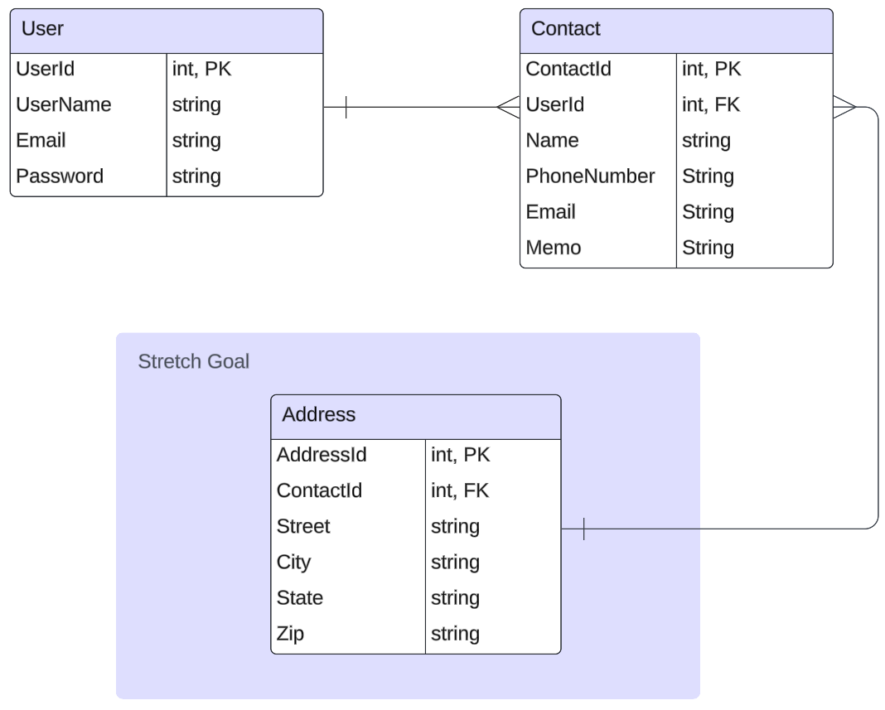

# Contact Manager

This is a Web API made in .NET to help users build, track and persist user's contact(s). 

## Project Member (Individual)
- Praween Pongpat

## Project Requirements
- README that describes the application and its functionalities
- ERD of your DB
- The application should be ASP.NET Core application
- The application should build and run
- The application should have unit tests and **at least 20% coverage** (at least 5 unit tests that tests 5 different methods/functionality of your code)
- The application should communicate via HTTP(s) (Must have POST, GET, DELETE)
- The application should be RESTful API
- The application should persist data to a SQL Server DB
- The application should communicate to DB via EF Core (Entity Framework Core)

## Tech Stack

- C# (Back End Programming Language)
- SQL Server (Local Hosting)
- EF Core (ORM Tech)
- ASP.NET (Web API Framework)

## MVP/Basic Goals
- Should be able to list all users' account
- Should be able to retrieve a user's account
- Should be able to create user's account
- Should be able to delete user's account
- Should be able to list all contacts for user's account
- Should be able to retrieve a contact for user's account
- Should be able to create contact for user's account
- Should be able to delete contact for user's account

## Stretch Goals
- Should be able to login to access user's account information
- Should be able to search all contacts for user's account
- Should be able to search a contact for user's account
- Should be able to update user's account information
- Should be able to update a contact information for user's account
- Should be able to sort contacts for user's account
- Should implement Address Entity to support each contact

## Entity Relationship Diagram

